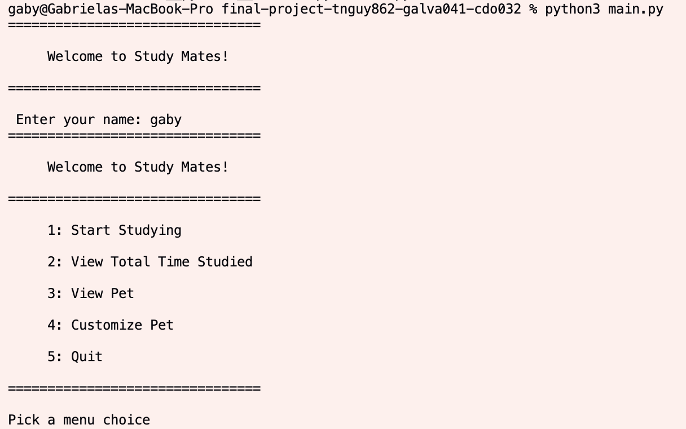
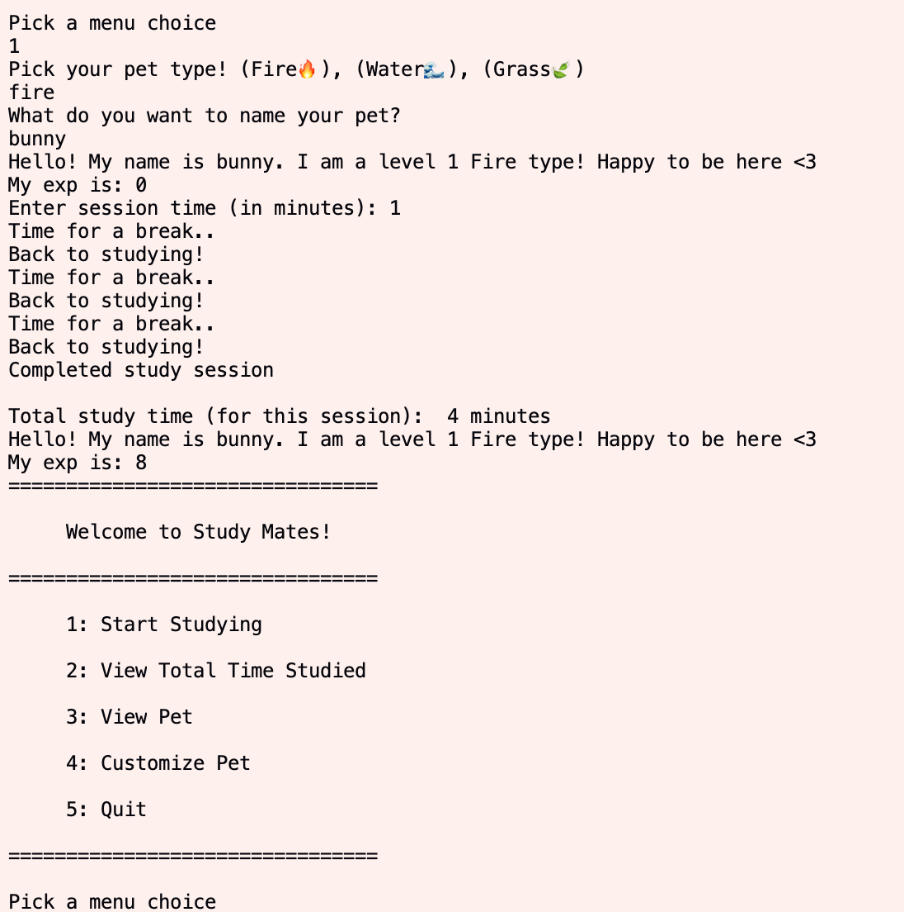
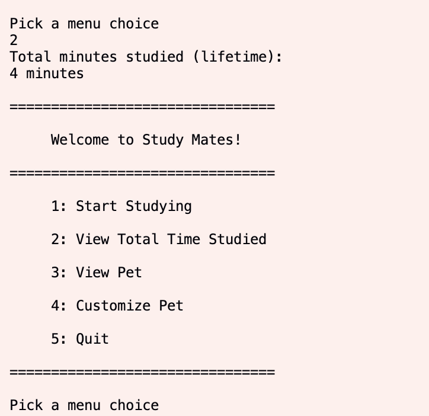
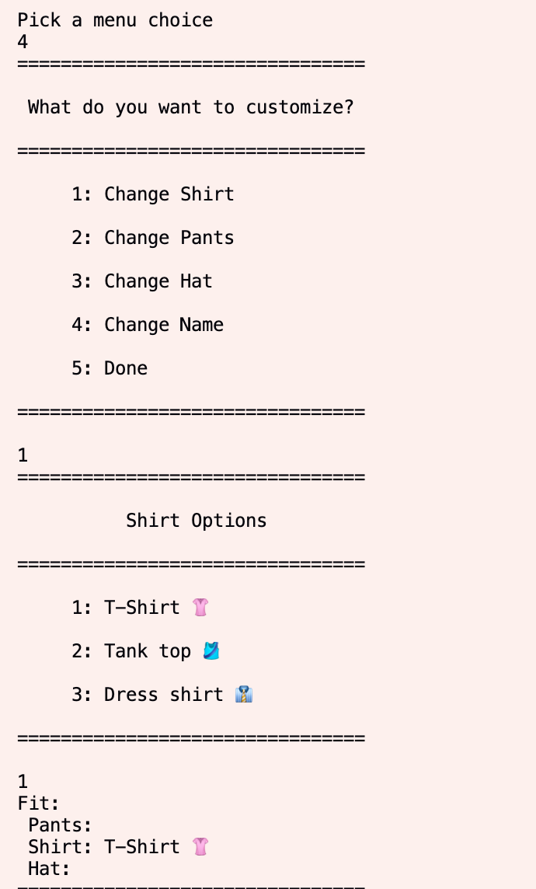
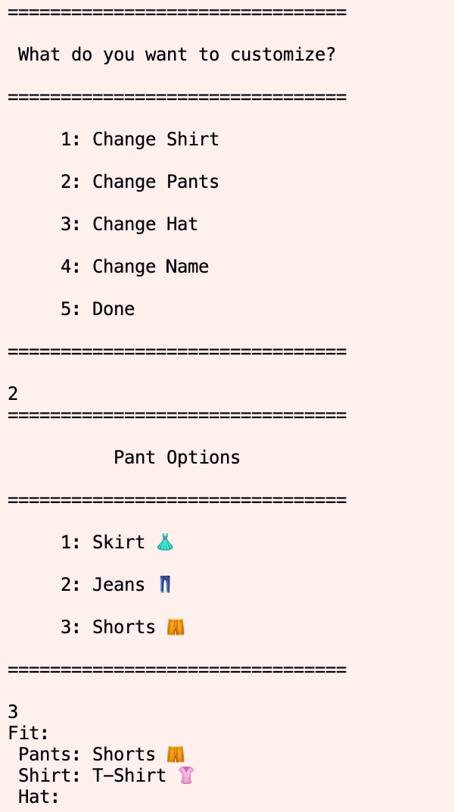
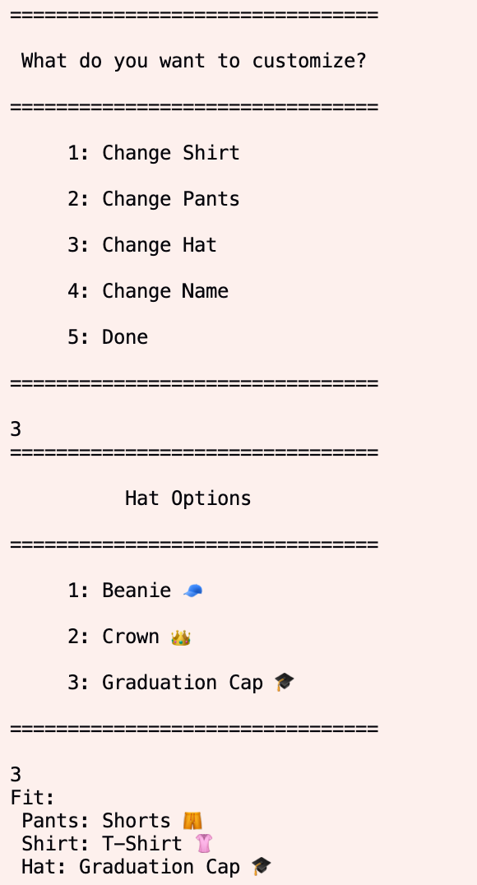
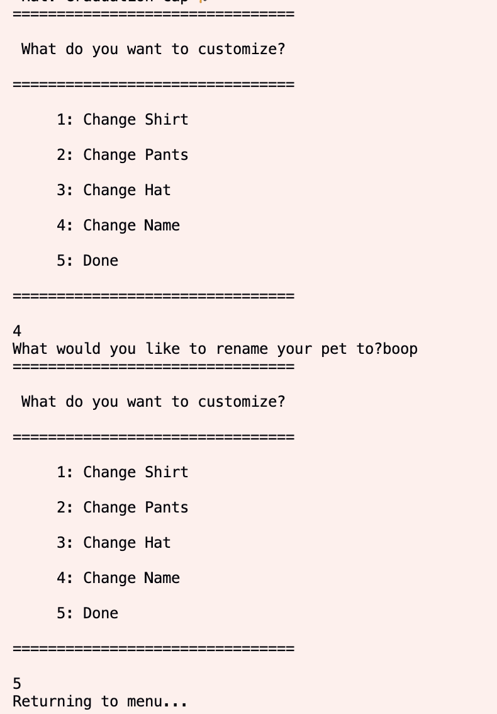
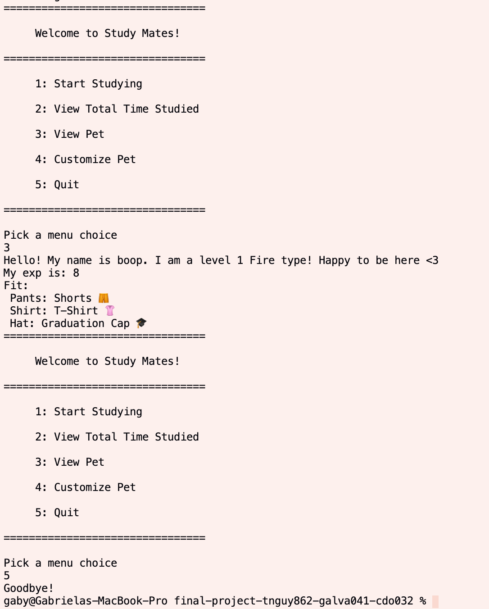

# Study Mates!
 > Authors: \<[Tann Nguyen](https://github.com/tannnguyen13)\> \<[Cindy Do](https://github.com/condoes)\> \<[Gabriela Alvarez](https://github.com/galva041)\>

## Project Description
  **General Description**
 >   * An app/extension that rewards you for each study session you complete with no distractions. Implements a pet system, where each time a user completes a study session, it levels up the pet they chose from the menu. User can change how long each of the study/break intervals are. (You can choose a new pet when you have maxed out the current pet)
 >   * You can also customize your monsters (adding hats, cute decorations, etc) without changing the overall functionality of the monster with the Decorator design pattern.
 >   * End Goal: the user has the option to set an end goal for themselves. More specifically, the user can set a time interval to work towards. For example, the user can only focus 20 minutes at a time and wants to be able to focus for an hour. The user can input this information and create for themselves a schedule to abide by and a goal to work towards.
 * **Importance**
 >   * During times of COVID-19 and Zoom University, it is really hard to stay focused on school work when there are so many distractions available via our phones. The goal of this application is to put our own twist on time management apps by modifying them to be catered to our interests. We enjoy the nostalgia of having a virtual pet, like we used to as kids with “Neopets” and “Tamagotchi,” therefore we will have similar pet options for our reward system.  
 * **What languages/tools/technologies do you plan to use? (This list may change over the course of the project)**
 >   * Python
* **Input/Output**
 >   * Input:
 >      * Study Time
 >      * Name for the pet
 >      * What element they want their pet to be
 >   * Output:
 >      * Study/work intervals
 >      * Timer counting down 
 >      * Output message when user completes their study session
 >      * Pet's experience, level, and outfit
* **Design Patterns**
 >   * *Behavioral Pattern:* Strategy
 >     * The goal of the user is to improve their focusing abilities. The user can do this by inputting how long they want their study session to be. From this, the pet they choose will gain experience in at different rates, with different level caps. For example, a fire type pet will gain x2 experience per minute, but will have a high cap to their max level. This way, the pet inherits the same experience function, but has their own way, or strategy of getting to their max level.
 >   * *Creation Pattern:* Abstract Factory
 >     * All of the monsters / eggs in the app are pretty much the same, except for the fact that there in a sense is a 'type' system (fire, water, and grass types). We can use the same structure for all the various monsters, but change out some details. Examples of these details would be the experience gain (as mentioned in the strategy pattern), what element the monster is, etc. With this design pattern, we are using the egg system as the main interface for the monsters, but we can split up the different interfaces into different categories such as rarity, element, etc. Fire types would be able to implement the FireType interface, and so on.
 >   * *Structural Pattern:* Decorator
 >     * Each character stems from a “character” abstract class and we want to implement the ability to earn points to customize each character’s clothing. With the decorator design pattern, we will be able to create a decorator object (Customizer) under the Character class that will help us easily update the user’s character (monster) without affecting the appearance of the other characters. The Customizer object will be extended to different clothing types (hat, shirt, pants, etc). 

 > ## Phase II
 
 
 

 > ## Final deliverable

 ## Screenshots
 > Screenshots of the input/output after running your application
 
 
 
 
 
 
 
 
 
 ## Installation/Usage
 >   - Download all the .py files excluding interface.py
 >   - To be able to run test_timer.py, you have to install the "mock" module (pip install mock)
 >   - Make sure "user1.txt" is empty before running
 >   - Run program using "python main.py" (Windows) or "python3 main.py" (Mac)
 
 ## Testing
 > We used the imported python library, "unittest", and created files for each test: "test_timer.py", "test_pet.py", and "test_customizer.py". From each files' names, you can see that we tested for timer, pet, and the customizer. For the file saving, we looked at the file and saw if the program was writing to the file correctly. 
 
